# Multi-target Canary Rollout — Podinfo on Lambda + EC2/ALB

One pipeline builds, signs and SBOMs a single Podinfo container image, then
canary-deploys the **same immutable digest** to two runtimes — Lambda behind
API Gateway and a 2-host EC2/Docker fleet behind an ALB — first in `dev`,
then (after human approval) in `prod`. CodeDeploy drives both canaries;
CloudWatch alarms roll either back automatically.



## How one image runs on both targets

Podinfo is a plain HTTP server; Lambda container images need an event
interface. The image bakes the **AWS Lambda Web Adapter** into
`/opt/extensions`: on Lambda it proxies API GW events to podinfo's HTTP port,
on EC2/Docker nothing executes it. A second tiny extension (`secret-fp`,
`app/secret-extension/`) logs a fingerprint of the Secrets Manager secret so
rotation is observable — also inert outside Lambda. Same digest, two runtimes,
no target-specific builds.

## Release flow

```
push to main
  └─ build: podinfo tests → buildx (everything pinned by digest/commit)
            → push to ECR → cosign sign (keyless OIDC) → syft SBOM → cosign attest
  └─ deploy dev   [GitHub env: dev]
        policy gate: cosign verify digest against this repo's pipeline on main
        ├─ Lambda: publish version → CodeDeploy Canary10Percent5Minutes on alias `live`
        └─ EC2:    CodeDeploy installs new-color containers on both hosts
                   → leader hook shifts ALB weights 10% → 2min alarm watch → 100%
        smoke + synthetic checks vs both front doors
  └─ deploy prod  [GitHub env: prod — requires reviewer approval]
        identical, with the identical digest (docs/PROMOTION_CHECKLIST.md)
```

**Rollback** is automatic on both targets: the CodeDeploy deployment groups
are bound to CloudWatch alarms (Lambda errors, API GW 5xx, ALB target 5xx,
target p99 response time). On EC2 the validating hook additionally restores
100% blue weight the moment an alarm fires during the canary hold. Demo:
`workflow_dispatch` with `chaos=true` floods `/status/500` through both front
doors during the dev canary and shows both targets rolling back.

## Decisions & trade-offs

- **EC2 canary mechanics**: CodeDeploy EC2/on-prem doesn't support weighted
  canary natively (that's Lambda/ECS-only). Both hosts run blue and green
  containers side-by-side on fixed ports (9898/9899) with one target group per
  color; CodeDeploy orchestrates install + validation, and its
  `ValidateService` hook (leader-elected instance) performs the weighted ALB
  shift gated on the rollback alarms. A failed shift fails the hook ⇒
  CodeDeploy auto-rollback. This follows the assignment's own design hint
  ("place green containers on both hosts; register green target group").
- **Canary parameters**: Lambda 10%/5min — the smallest standard config, and
  5 minutes ≥ 5 alarm evaluation periods. EC2 10%/2min — with 1-minute alarm
  periods the hold gives ≥2 evaluations; at demo traffic longer holds add
  waiting, not signal. Alarm thresholds are tight (any Lambda error, 3×5xx/min,
  p99 > 1s) because podinfo's healthy baseline is zero errors at ~ms latency.
- **Digest-only promotion**: ECR tags are immutable and only `@sha256:…` is
  ever deployed; the policy gate re-verifies the signature in *every* deploy
  job, so an unsigned or foreign image cannot reach either runtime.
- **Self-signed ALB cert** (no domain available): imported into ACM, TLS 1.3
  policy. Clients use `-k`; with a Route 53 domain this becomes a DNS-validated
  ACM cert with zero further changes.
- **Terraform vs. deploy-time state**: listener weights, alias versions and
  function image are deploy-time state, so they carry `ignore_changes` —
  `terraform apply` stays idempotent mid-release and never reverts traffic.
- **Secrets**: the token value never leaves Secrets Manager — both targets
  expose only a SHA-256 fingerprint (EC2: injected env var; Lambda: extension
  log line). An account-wide CloudWatch Logs data-protection policy masks
  anything matching the token format as defense-in-depth (proof:
  `dkyd_…` strings appear masked in any log group).
- **Public subnets, no NAT**: instances are reachable only through the ALB SG;
  egress needs (ECR, SSM, CW) go via the IGW. A NAT gateway would add ~$65/mo
  of idle cost to a demo; private subnets + endpoints are the prod-account
  shape (see docs/SCALING.md).

## Bootstrap (fresh clone → running system)

Prereqs: AWS CLI with admin credentials, `tfenv`, `gh` (authenticated), Git.

```bash
scripts/bootstrap.sh                      # state bucket + lock table (idempotent)
tfenv install                             # resp0cts .terraform-version
scripts/tf.sh global -    apply           # ECR, OIDC roles, KMS, SNS, secret+rotation, redaction
scripts/tf.sh ec2    dev  apply           # VPC, ALB, ASG, CodeDeploy
git push origin main                      # first pipeline run pushes the first image
scripts/tf.sh lambda dev  apply           # needs >=1 image in ECR
scripts/tf.sh ec2    prod apply
scripts/tf.sh lambda prod apply -var provisioned_concurrency=2
scripts/tf.sh observability - apply -var 'envs=["dev","prod"]'   # dashboard
gh workflow run pipeline                  # full run: dev → approval → prod
```

GitHub setup (one-time): repo public or GitHub Pro, branch protection on
`main`, environments `dev` and `prod` with a required reviewer on `prod`.

## Operate

- **Dashboard**: CloudWatch → `canary-rollout` (canary split per target,
  API GW/Lambda/ALB/host metrics). Alarms notify `canary-rollout-alarms` (SNS).
- **Trace a request end-to-end**: every podinfo response carries
  `X-Request-Id`. API GW access logs (`/aws/apigw/…`) log `requestId`,
  function logs carry the same correlation id, EC2 access logs land in
  `/canary/<env>/ec2/docker`. The image digest links runtime back to the
  signed build run (OCI labels + run summary).
- **Rotate the secret**: `scripts/rotate-and-verify.sh dev` — rotates,
  refreshes both targets, proves fingerprints changed while staying healthy.
- **Measure cold starts**: `scripts/measure-coldstart.sh prod` before/after
  enabling provisioned concurrency (results in docs/SCALING.md).
- **Rollback demo**: Actions → pipeline → Run workflow → `chaos=true`.

## Promote

Pipeline runs end-to-end on every push to `main`; promotion to prod is the
approval on the `prod` environment (checklist: `docs/PROMOTION_CHECKLIST.md`).
The prod jobs reuse the digest from the build job output — nothing is rebuilt.

## Destroy

```bash
scripts/teardown.sh        # all stacks, reverse order, idempotent
scripts/teardown.sh --all  # also removes the TF state bucket + lock table
```

## Repo layout

```
.github/workflows/   pipeline.yml (build+orchestration), deploy.yml (reusable per-env deploy)
app/                 Dockerfile (podinfo + LWA + secret-fp extension), extension source
infra/               global/ lambda/ ec2/ observability/ (Terraform; scripts/tf.sh wrapper)
scripts/             bootstrap, tf wrapper, CodeDeploy hooks, smoke, rotation, cold-start, teardown
docs/                diagram, SCALING.md, PROMOTION_CHECKLIST.md, EVIDENCE.md
ENVIRONMENT.md       versions, regions, names/ARNs (no values)
```
